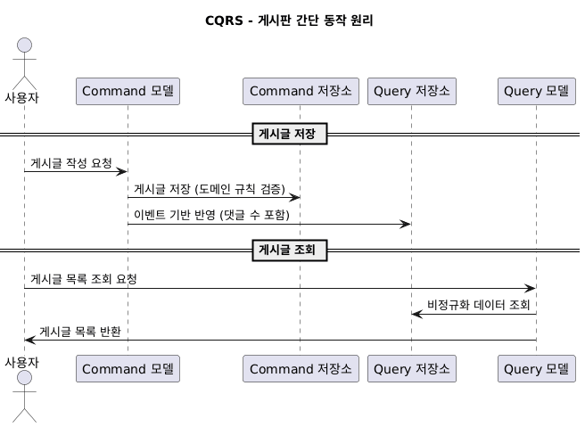

# 1. CQRS란?
명령(Command)와 조회(Query의 책임을 아예 다른 모델로 분리하는 아키텍처 패턴입니다.

- CQS는 메서드 등 코드레벨에서 읽기, 쓰기 모델 분리
- CQRS는 시스템 차원에서 읽기, 쓰기 모델 분리

Command는 상태 변경(쓰기) 담당, Query는 상태 변경 없는 조회만 담당하며
두 모델이 **코드 레벨뿐 아니라** **데이터 모델**, **저장소**, **스케일링 전략**까지 분리하는 것을 의미합니다.

# 2. 필요한 이유
1. 읽기/쓰기 성격이 다름
    - 쓰기 모델 : 정합성 보장 (정규화, 트랜잭션 안정성 중시)
    - 읽기 모델 : 조회 성능 최적화 (비정규화, 캐시, 검색 엔진 활용 등)
2. 읽기, 쓰기 간 트래픽 차이
    - 대부분 시스템은 조회 비율이 높음
    - CQRS로 읽기 모델 최적화
3. 확장성
    - Command는 도메인 규칙과 무결성 집중
    - Query는 별도 저장소 (ElasticSearch, Redis 등)에 저장 후 빠른 조회
    - 예시)
        - Command : 재고 1 이상이어야 주문 가능 등
        - Query : 주문 내역 검색, 베스트셀러 집계 등

# 3. 간단 동작 원리
게시판 작성을 예시로 아래와 같은 흐름으로 진행됩니다.

## 3-1. 저장
1. 사용자가 게시판에 게시글을 작성합니다.
2. Command가 도메인 규칙 (예, 특정 게시판 권한 유무 등)을 검증하고 Command 저장소에 저장합니다.
3. 이벤트 핸들러가 Query 저장소에 반영
    - 기존 게시글과 댓글은 정규화로 분리되어 있었으나, 이 과정에서 JOIN을 통해 개수도 함께 저장할 수 있음

## 3-2. 조회
1. 사용자가 게시글 목록을 조회합니다.
2. Query 저장소에서 비정규화 된 데이터 조회

쓰기와 읽기가 각각 다른 경로에서 처리됩니다.

# 4. CQRS 장점
1. 성능 최적화
    - 읽기와 쓰기 각각 성격에 맞는 구조로 설계 가능
2. 확장성
    - 읽기, 쓰기를 독립적으로 확장 가능
3. 복잡성 감소
    - 쓰기 모델은 데이터 데이터 규칙 및 정합성 확인
    - 읽기 모델은 단순 조회 최적화 담당

# 5. CQRS 단점
1. 복잡성 증가
    - 모델이 두 개가 되기에 동기화 비용 발생
2. 최종 일관성 문제
    - Command와 Query 반영 사이에 시간차 발생 가능
    - API 설계 시 응답 지연 허용 여부를 별도로 확인 필요
        - 예) 주문 직후 목록에 안보여도 되는가 -> CQRS 적합
        - 예) 잔액 즉시 조회 및 정확성 필요한가 -> CQRS 부적합
3. 개발, 운영 시 부담 증가
    - 동기화를 위해 이벤트 발행, 동기화 로직, 중복 이벤트 처리 등 고려할 부분 발생

# 6. 언제 CQRS를 적용하면 좋을지 판단
1. 실시간 집계나 검색 요구 시
    - 쓰기 모델의 경우 많은 정규화로 데이터 조회 시 별도 비정규화가 필요할 때?
        - 예로 상품 베스트 셀러 순위, 실시간 댓글 수, 텍스트 검색 같은 기능이 필요할 때
2. 읽기/쓰기 확장성 요구의 불균형
    - 쓰기는 RDB 단일 트랜잭션으로도 충분하지만, 조회는 수십 배 스케일이 필요할 때
        - 주의할 점) 단순 동일 저장소를 확장하는 건, Replica로 구분 필요

---
# 느낀점
Command와 Query 동기화하는 방식에 대해서는 내용이 길어질 것 같아 별도로 정리하도록 하겠습니다.

일단 아직도 헷갈리기에 직접 설계해 보고 구성을 해봐야 알 것 같습니다.

이미 읽기, 쓰기 노드 분리한 것만으로도 이것도 CQRS가 아닌가 싶었으나, 이거는 동일 저장소에 모델도 같기에 단순 읽기 부하 분산이라는 것도 정리할 수 있었습니다.

그리고 집계를 위해 매일 스케줄링으로 많은 데이터를 별도 테이블에 저장하던 것도, 완전히 다른 저장소에 저장하면 CQRS 개념에 가까워지는 것도 알게 되었습니다.